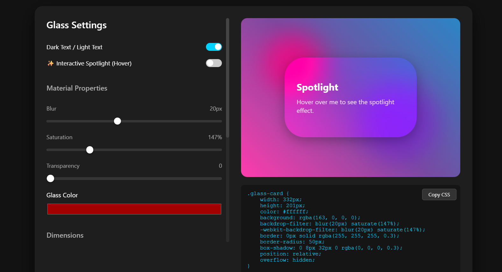

# CSS-Glassmorphism
# 💎 Ultimate Glassmorphism Generator

A powerful, interactive web application that allows developers and designers to visually generate CSS code for the **Glassmorphism** effect (frosted glass). 

Adjust blur, transparency, and colors in real-time, test it against different backgrounds, and copy the production-ready CSS with a single click.




## 🚀 Features

- **🎨 Visual Editor:** Real-time controls for Blur, Transparency, Saturation, and Color.
- **📏 Dimension Control:** Adjust Width, Height, Border Radius, and Outline thickness.
- **🖼 Dynamic Backgrounds:** Choose from preset gradients or **upload your own image** via the FileReader API.
- **✨ Spotlight Effect:** Interactive hover effect that tracks mouse movement (using JS & CSS variables).
- **🌗 Content Mode:** Toggle between Dark and Light text to test contrast.
- **💾 Auto-Save:** Your settings are automatically saved to `LocalStorage`, so you don't lose progress on refresh.
- **📋 One-Click Copy:** Instantly copy the generated CSS to your clipboard.
- **cyberpunk UI:** Custom-styled range sliders for a modern look.

## 🛠 Tech Stack

- **HTML5**: Semantic structure.
- **CSS3**: CSS Variables, Flexbox/Grid layouts, Backdrop-filter, Custom Input styling.
- **JavaScript (Vanilla)**: DOM manipulation, Event handling, FileReader API, LocalStorage.

## 📂 Project Structure

```text
glass-generator/
│
├── index.html        # Main HTML file
├── css/
│   └── style.css     # Styles (Includes custom slider CSS)
├── js/
│   └── script.js     # Logic (State management, Event listeners)
└── README.md         # Project documentation
